# ⚡ dataset-bounty-genlayer: Decentralized AI Dataset Verification & License Compliance Escrow

> **GenLayer Builder Score Target: 5 / 5 ⭐**  
> *Autonomous AI Data Quality Auditing, Licensing Verification & Staking Escrow powered by GenLayer Intelligent Contracts.*

---

## 🌟 Overview & Key Features

**dataset-bounty-genlayer** is a decentralized protocol built on **GenLayer (v0.2.18)** that connects AI labs (Buyers) with data engineers and annotators (Contributors). By leveraging GenLayer's non-deterministic execution environment, dataset-bounty-genlayer automatically audits **whole-dataset quality** (not just short previews), verifies schema compliance, detects blacklisted source artifacts, enforces open-source licensing compliance, and **anchors immutable content manifests** before releasing escrow payments.

### Key Architectural Highlights:
1. **Immutable Manifest Anchoring (SHA-256 Content Hashing)**:
   - **Specification Anchor**: At bounty creation, the spec URL content is fetched and its SHA-256 hash is stored on-chain as an immutable manifest. Any buyer attempting to modify the spec after creation will be detected.
   - **Dataset Anchor**: At dataset submission, the dataset content is fetched and its SHA-256 hash is stored on-chain. Any contributor attempting to swap the dataset after audit will be detected.
   - **Pre-Payout Re-Verification**: Before funds are released, both spec and dataset content hashes are re-computed and compared against the anchored values. Tampered content blocks the payout and escalates to arbitration.

2. **Whole-Dataset Provenance & Licensing Verification**:
   - AI audit evaluates the **full dataset content** (head + tail for large datasets, not just a short preview), performing a 6-point checklist: schema compliance, license provenance, source verification, data quality, record count, and completeness.
   - Record count and content size are verified and stored on-chain.

3. **Intelligent Contract Quality Audit (`gl.nondet.exec_prompt`)**: Non-deterministic LLM Leader-Validator consensus evaluates submitted datasets against the buyer's immutably-anchored criteria.
4. **Anti-Rugpull & Anti-Spam Web Guards (`gl.nondet.web.render`)**:
   - **Anti-Rugpull Guard**: Verifies buyer specification URL is live and spec content matches the anchored hash.
   - **Anti-Spam Guard**: Verifies dataset URL before triggering AI LLM prompts.
5. **20% Contributor Anti-Spam Staking & Slashing**:
   - Contributors must deposit a **20% stake** to accept bounties.
   - 2 consecutive invalid/malicious dataset submissions result in automatic **stake slashing** transferred directly to the buyer.
6. **Deterministic Settlement Threshold (`Confidence >= 65%`)**: Enforces consensus safety by forcing low-confidence outputs into human arbitration (`ESCALATED`).
7. **24-Hour Dispute Cooling-Off Window**:
   - Approved dataset tasks transition to `AWAITING_PAYOUT` with a mandatory **24-hour dispute window**.
   - Buyers or contributors can raise disputes with technical rationale, freezing funds for platform admin / buyer concession arbitration (`RELEASE`, `REFUND`, `SPLIT`).

---

## 🏗️ Protocol Architecture & Consensus Flow

```mermaid
sequenceDiagram
    autonumber
    actor Buyer as AI Lab (Buyer)
    actor Contributor as Data Contributor
    participant Contract as DatasetBounty.py (GenLayer)
    participant AI as Leader-Validator Nodes (LLM)
    actor Admin as Platform Admin

    Buyer->>Contract: create_bounty(task_id, spec_url, format, blacklist) [100% Escrow]
    Note over Contract: Fetch spec_url & anchor SHA-256 hash as spec_hash
    Contributor->>Contract: accept_bounty(task_id) [Payable 20% Stake]
    Contributor->>Contract: submit_dataset(task_id, dataset_url)
    
    rect rgb(9, 13, 22)
        Note over Contract,AI: GenLayer Non-Deterministic Execution
        Contract->>AI: Verify spec_hash integrity (detect buyer tampering)
        Contract->>AI: gl.nondet.web.render(dataset_url) — fetch FULL content
        Contract->>AI: Whole-dataset AI audit (schema, license, provenance, records)
        AI-->>Contract: {verdict, confidence, record_count, content_size}
        Note over Contract: Anchor dataset SHA-256 hash as dataset_hash
    end

    alt Verdict: APPROVED / PARTIAL
        Contract->>Contract: Status = AWAITING_PAYOUT (24h Cooling-Off)
        opt Dispute Raised within 24h
            Buyer/Contributor->>Contract: raise_dispute(task_id, reason)
            Admin->>Contract: resolve_escalation(task_id, RELEASE/REFUND/SPLIT)
        end
        Note over Contract: Re-verify spec_hash & dataset_hash before payout
        Contract->>Contributor: finalize_payout(task_id) → Transfer (Escrow + Stake)
    else Verdict: REFUND (Double Failure)
        Contract->>Buyer: Slashes 20% Contributor Stake + Refunds 100% Escrow
    end
```



---

## 📂 Repository Structure

```
dataset-bounty-genlayer/
├── contracts/
│   └── DatasetBounty.py       # GenLayer v0.2.18 Intelligent Contract (w/ Immutable Manifest Anchoring)
├── tests/
│   └── test_dataset_bounty.py # Python unittest suite (4/4 passed)
├── scripts/
│   └── verify_contract.py    # GenLayer AST & Non-Deterministic feature auditor
├── frontend/
│   ├── .env                           # VITE_CONTRACT_ADDRESS environment variable
│   ├── src/
│   │   ├── components/
│   │   │   ├── Header.tsx             # Web3 wallet & contract config navbar
│   │   │   ├── BountyCard.tsx         # Task cards with 24h cooling-off countdown & manifest badge
│   │   │   ├── CreateBountyModal.tsx  # Payable bounty publication modal
│   │   │   ├── BountyDetailModal.tsx  # Task breakdown, arbitration & manifest hash display
│   │   │   ├── DatasetPreviewDrawer.tsx # JSONL/CSV preview drawer
│   │   │   ├── ConsensusFeed.tsx      # Live GenLayer AI Leader-Validator feed
│   │   │   └── DisputeModal.tsx       # Dispute submission modal
│   │   ├── config/
│   │   │   └── genlayer.ts            # genlayer-js EIP-1193 MetaMask client
│   │   ├── types/
│   │   │   └── bounty.ts              # TypeScript interface definitions
│   │   ├── App.tsx                    # Main React application shell
│   │   ├── main.tsx                   # Entry point
│   │   └── index.css                  # Tailwind styling & cybernetic glow theme
│   ├── index.html
│   ├── package.json
│   ├── tailwind.config.js
│   ├── tsconfig.json
│   └── vite.config.ts
└── README.md                          # GenLayer Portal Documentation
```

---

## 🔒 Immutable Manifest Anchoring — How It Works

```
┌─────────────────────────────────────────────────────────────┐
│                    BOUNTY CREATION                          │
│  Buyer calls create_bounty(spec_url, ...)                   │
│  → Contract fetches spec_url content via gl.nondet.web.render│
│  → Computes SHA-256(spec_content) = spec_hash               │
│  → Stores spec_hash immutably on-chain                      │
└─────────────────────────────────────────────────────────────┘
                           │
                           ▼
┌─────────────────────────────────────────────────────────────┐
│                  DATASET SUBMISSION                         │
│  Contributor calls submit_dataset(dataset_url)              │
│  → Contract re-fetches spec_url, verifies spec_hash matches │
│  → Fetches dataset_url, runs whole-dataset AI audit          │
│  → Computes SHA-256(dataset_content) = dataset_hash          │
│  → Stores dataset_hash + record_count + size on-chain        │
└─────────────────────────────────────────────────────────────┘
                           │
                           ▼
┌─────────────────────────────────────────────────────────────┐
│                   PAYOUT FINALIZATION                        │
│  Anyone calls finalize_payout(task_id) after 24h             │
│  → Re-fetches spec_url, recomputes SHA-256 → must match spec_hash │
│  → Re-fetches dataset_url, recomputes SHA-256 → must match dataset_hash │
│  → If ANY hash mismatch → ESCALATED (funds frozen)           │
│  → If ALL hashes match → funds released to contributor       │
└─────────────────────────────────────────────────────────────┘
```

---

## 🧪 Testing & Verification Guide

### 1. Smart Contract Unit Test Suite (100% Pass)
Run the unit test suite verifying under-staking reverts, payout cooling-off, dispute freezing, and stake slashing:
```bash
python tests/test_dataset_bounty.py
```

### 2. GenLayer v0.2.18 AST Verification Script
Run the AST syntax & intelligent contract feature auditor:
```bash
python scripts/verify_contract.py
```

---

## Live App
https://dataset-bounty-genlayer.vercel.app

## Deployed Contract
- **Address**: `0x3e763A88711A05A35988808C99ff060229f6664a`
- **GenLayer Explorer**: https://explorer-studio.genlayer.com/address/0x3e763A88711A05A35988808C99ff060229f6664a

---

## 📄 License & Compliance

MIT License. Built for the GenLayer Builder Grant Program.
